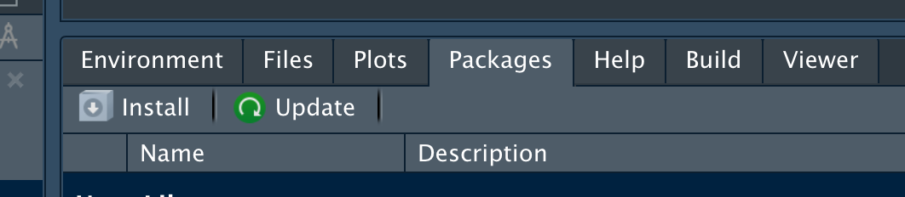

# Rahmen


## Der Prozess der Datenanalyse

Datenanalyse kann man als Prozess mit mehreren Schritten verstehen, s. Abb. \@ref(fig:prozess).


```{r prozess, out.width = "50%", fig.cap = "Der Prozess der Datenanalyse"}
knitr::include_graphics("img/prozess.png")
```


Natürlich kann man sich auch andere sinnvolle Darstellungen dieses Ablaufs vorstellen.


## Warum R?


R ist *open source*, jeder kann beitragen. Das tuen auch viele. 
Daher gibt es viel mehr Entwickler für R wie für ein propriäteres Programm wie z.B. SPSS.
Der Unterschied in der Zahl der Entwickler ist im Diagramm \@ref(fig:r-spsss) dargestellt.
Achtung: Die Diagrammgrößen sind hier rein "gefühlt" und sollen lediglich einen Eindruck vermitteln.


```{r r-spss, fig.cap = "Gefühlter Vergleich der Anzahl der Entwickler nach Statistik-Software"}
library(tidyverse)
d <-
  tibble(xmin = c(0,10),
         xmax = c(1, 100),
         ymin = c(1,1),
         ymax = c(2, 100),
         fill = c("SPSS", "R"))


ggplot(d) +
    geom_rect(aes(xmin = xmin, xmax = xmax, ymin = ymin, ymax = ymax, fill = fill)) +
  theme_minimal()

```


Für einen genaueren Eindruck kann man viele Statistiken heranziehen.
Nehmen wir die Anzahl der Suchanfragen bei <stackoverflow.com>,
dem größten FAQ-Forum für Software-Entwicklung.
Wir vergleichen Suchanfragen mit dem Tag `[r]` zu Suchanfragen mit dem Tag `[spss]`^[Durchgeführt am 2022-02-24, 17:21 CET]. Die Ergebnisse sind in Abbildung \@ref(fig:stackoverflow1) dargestellt.


```{r stackoverflow1, fig.cap = "Suchanfragen nach R bzw SPSS, Stand 2022-02-24"}
d <- tibble(
  Anzahl = c(1923,438255),
  Tag = c("spss", "r")
)

ggplot(d) +
  aes(x = Tag, y = Anzahl) +
  geom_col() +
  theme_minimal() +
  geom_label(aes(y = Anzahl, label = Anzahl))
```


## Architektur von R


### R vs. RStudio

@ismay_moderndive_2019 zeigen eine schöne Analogie, was der Unterschied von *R* und *RStudio* ist (s. Abbildung \@ref(fig:r-rstudio)).


```{r r-rstudio, fig.cap = "R vs. RStudio"}
knitr::include_graphics("https://d33wubrfki0l68.cloudfront.net/0b4d0569b2ddf6147da90b110fbb2a17653c8b08/f06f3/images/shutterstock/r_vs_rstudio_1.png")
```


Wir verwenden beide Programme. Aber wir *öffnen* nur RStudio. 
RStudio findet selbständig R und öffnet diese "heimlich".
Öffnen Sie nicht noch extra R (sonst wäre R zweifach geöffnet).


Hier ein Screenshot von der Oberfläche von RStudio (s. Abbildung \@ref(fig:rstudio)).


```{r rstudio, fig.cap = "So sieht RStudio aus"}
knitr::include_graphics("https://d33wubrfki0l68.cloudfront.net/8b21462ee6be0450582226771d13b89481492ee1/b1757/images/rstudio_screenshots/rstudio.png")
```


### R-Studio Cloud


RStudio Cloud ist ein Webdienst von RStudio (zum Teil kostenlos).
Man kann damit online mit R arbeiten. Die Oberfläche ist praktisch identisch zur 
Desktop-Version (S. Abbildung \@ref(fig:rstudio-cloud)).
Ein Vorteil ist, dass man als Nutzer nichts installieren muss.


```{r rstudio-cloud, fig.cap = "RStudio Cloud"}
knitr::include_graphics("img/rstudio-cloud.png")
```


### R-Pakete


Typisch für R ist sein modularer Aufbau: Man kann eine große Zahl an Erweiterungen ("Pakete") installieren, alle kostenlos.

In R Paketen "wohnen" Funktionen, also Dinge, die R kann, wenn das Paket verfügbar ist.

Man kann sich daher ein R-Paket vorstellen wie ein Buch:
Wenn R es gelesen hat, dann kennt es die Inhalte.
Diese Inhalte könnten irgendwelche Formeln, also Berechnungen sein.
Es könnte aber die "Bauanleitung" für ein schönes Diagramm sein.

Ist ein spezielles R-Paket auf Ihrem Computer vorhanden,
so können Sie diese Funktionalität nutzen.


Die Zahl an diesen "Paketen" ist groß (zur Verdeutlichung s. Abbildung \@ref(fig:ship)).


```{r ship, fig.cap = "Containershiff, Corey Seeman, CC-BY-NC 20, Flickr.com"}
knitr::include_graphics("img/11102039694_d42ca1ff1c_c.jpg")
```


*Erweiterungen* kennt man von vielen Programmen, sie werden auch *Add-Ons*, *Plug-Ins* oder sonstwie genannt.

Man siehe zur Verdeutlichung Erweiterungen beim Broswer Chrome (Abbildung \@ref(fig:chrome)).


```{r chrome, fig.cap = "Erweiterungen beim Browser Chrome"}
knitr::include_graphics("img/chrome-extensions.png")
```


Die Anzahl der R-Pakete ist groß; allein auf dem "offiziellen Web-Store" (nennt sich "CRAN") von R 
gibt es ca. 20,000 Pakete (Abbildung \@ref(fig:cran); [Quelle](https://gist.github.com/daroczig/3cf06d6db4be2bbe3368)).


```{r cran, fig.cap = "Anzahl der Pakete auf CRAN"}
knitr::include_graphics("https://gist.githubusercontent.com/daroczig/3cf06d6db4be2bbe3368/raw/c6e74a90d262be7998e67d464314a8cd7a2b05ed/number-of-submitted-packages-to-CRAN.png")
```


#### Pakete installieren

Wie jede Software muss man Pakete (Erweiterungen für R) erst einmal installieren,
bevor man sie verwenden kann.
Ja, einmal installieren reicht.

Das geht komfortabel, wenn man beim Reiter *Packages* auf *Install* klickt (s. Abb. \@ref(fig:install-packages)).

```{r install-packages, fig.cap = "So kann man Pakete in R installieren."}

```


Dann öffnet sich ein Menü, wo man die Namen der gewünschten R-Pakete eingeben kann (s. Abbildung \@ref(fig:install-packages2))

```{r install-packages2, fig.cap = "Hier den oder die Namen der gewünschten R-Pakete eingeben."}

```


Welche R-Pakete sind denn schon installiert?


Im Reiter *Packages* können Sie nachschauen, welche Pakete 
auf Ihrem Computer schon installiert sind.
Diese Pakete brauchen Sie logischerweise dann *nicht* noch mal installieren.


Ja, aber welche R-Pakete "soll" ich denn installieren, welche brauch ich denn?

Im Moment sollten Sie die folgenden Pakete installiert haben:

- `tidyverse`
- `rstatix` 


Wenn Sie die noch nicht installiert haben sollten,
dann können Sie das jetzt ja nachholen.


#### Pakete starten


Wenn Sie ein Softwareprogramm - nichts anderes sind R-Pakete - installiert haben,
müssen Sie es noch *starten*.

Merke: Ein bestimmtes Paket muss man nur einmalig installieren.
Aber man muss es jedes Mal neu starten, wenn man R (bzw. RStudio) startet.

Sie erkennen leicht, ob ein Paket gestartet ist, wenn Sie ein Häkchen vor dem
Namen des Pakets in der Paketliste (Reiter *Packages*) sehen, s. Abbildung \@ref(fig:install-packages).


### Projekte in R


Ein *Projekt* in RStudio ist letztlich ein Ordner, 
der als "Basis" für eine Reihe von Dateien verwendet wird.
Sagen wir, das Projekt heißt `cool_stuff`. 
RStudio legt uns diesen Ordner an einem von uns gewählten Platz auf unserem Computer an.
Das ist ganz praktisch, weil man dann sagen kann "Hey R, nimmt die Datei 'daten.csv'", 
ohne einen Pfad anzugeben.
Vorausgesetzt, die Datei liegt auch im Projektordner (`cool_stuff`).

Projekte kann anlegen mit Klick auf das Icon, das einen Quader mit dem Buchstaben R darin anzeigt (s. Abbildung \@ref(fig:rstudio-projekte))


```{r rstudio-projekte, fig.cap = "RStudio-Projekte, Beispiele", out.width = "25%"}
knitr::include_graphics("img/rstudio-projekte.png")

```


### Skriptdateien

Die R-Befehle ("Syntax") schreiben Sie am besten in eine speziell dafür 
vorgesehene Textdatei in RStudio.
Eine Sammlung von (R-)Befehlen nennt man auch ein *Skript*,
daher spricht man auch von einer *Skriptdatei*.
Um eine neue R-Skriptdatei zu öffnen, klicken Sie auf das Icon,
das ein weißes Blatt mit einem grünen Pluszeichen zeigt, s.
Abbildung \@ref(fig:script-new).


```{r script-new, fig.cap = "So erstellen Sie eine neue Skriptdatei.", out.width="50%"}
knitr::include_graphics("img/script-new.png")
```


Vergessen Sie nicht zu speichern,
wenn Sie ein tolles Skript geschrieben haben.
Dafür gibt es mehrere Möglichkeiten:

- Strg+S
- Menü: File > Save
- Klick auf das Icon mit der Diskette (vgl. Abbildung \@ref(fig:script-new))


Eine Skriptdatei können Sie in typischer Manier öffnen:

- Strg+O
- Klick auf das Icon mit der Akte und dem grünen Pfeil (vgl. Abbildung \@ref(fig:script-new))
- Menü: File > Open File...


## Grundlagen von R


### Variablen

In jeder Programmiersprache kann man Variablen definieren,
so auch in R:


```{r}
richtige_antwort <- 42
falsche_antwort <- 43
typ <- "Antwort"
ist_korrekt <- TRUE
```


Der *Zuweisungspfeil* `<-` definiert eine neue *Variable* (oder überschreibt den Inhalt,
wenn die Variable schon existiert).


Sie können sich eine Variable wie einen Becher oder Behälter vorstellen,
der bestimmte Werte enthält. 
Auf dem Becher steht (mit Edding geschrieben) der Name des Bechers.
Natürlich können Sie die Werte aus dem Becher entfernen und sie
durch neue ersetzen (vgl. Abbildung \@ref(fig:def-vars)).


```{r def-vars, fig.cap = "Variablen zuweisen", out.width="25%"}
knitr::include_graphics("img/Variablen_zuweisen.png")
```


R kann übrigens auch rechnen:

```{r}
die_summe <- falsche_antwort + richtige_antwort
```


Der *Zuweisungspfeil* `<-` definiert eine neue *Variable* (oder überschreibt den Inhalt,
wenn die Variable schon existiert).


Aber was ist jetzt der Wert, der "Inhalt" der Variable `die_summe`? 

Um den Wert, d.h. den Inhalt einer Variablen in R *auszulesen*, 
geben wir einfach den Namen des Objekts ein:

```{r}
die_summe
```


Was passiert wohl, wenn wir `die_summe` jetzt wie folgt definieren:

```{r}
die_summe <- falsche_antwort + richtige_antwort + 1
```


Wer hät's geahnt:

```{r}
die_summe
```


### Funktionen - "Befehle"


#### Vektoren

Das, was R kann, ist in "Funktionen" hinterlegt.
Ein Beispiel für eine solche Funktion könnte sein: 
"Berechne den Mittelwert" (schauen wir uns gleich an). 

Ein weiteres Beispiel für eine Funktion ist:
"Erstelle eine Liste (Vektor) von Werten".

Das geht so:

```{r}
Antworten <- c(42, 43)
```


Der Befehl `c` (c wie *c*ombine) fügt mehrere Werte zusammen zu einer Liste (einem Vektor).

Mit dem Zuweisungspfeil geben wir dieser Liste einen Namen, hier `Antworten`. 
Diese Liste besteht aus zwei Werten, zuerst `42`, dann kommt `43`.


#### Unsere erste statistische Funktion


Jetzt wird's ernst. Jetzt kommt die Statistik.
Berechnen wir also unsere erste statistische Funktion:
Den Mittelwert. Puh.


```{r}
mean(Antworten)
```

Sie hätten `Antworten` auch durch `c(42, 43)` ersetzen können,
so haben Sie ja schließlich die Variable gerade definiert.


## Weiterführende Hinweise

"Warum R? Warum, R?" heißt ein Kapitel in @sauer_moderne_2019, das einiges zum Pro und Contra von R aufführt.
In Kapitel 3 in der gleichen Quelle finden sich viele Hinweise, wie man R startet.
Alternativ bietet [Kapitel 1](https://moderndive.com/1-getting-started.html) von @ismay_moderndive_2019 einen guten Überblick.


