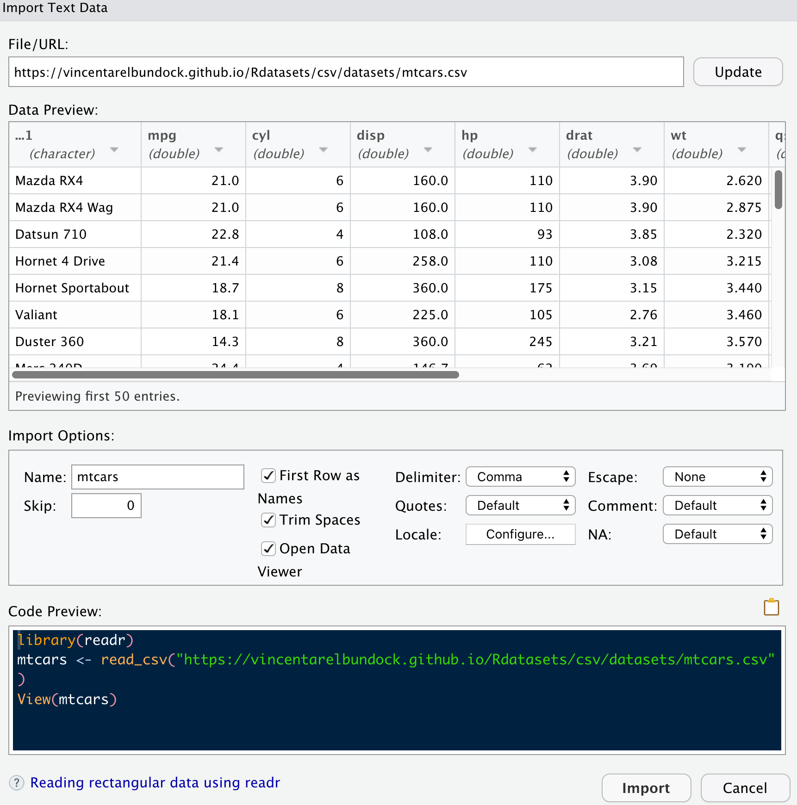
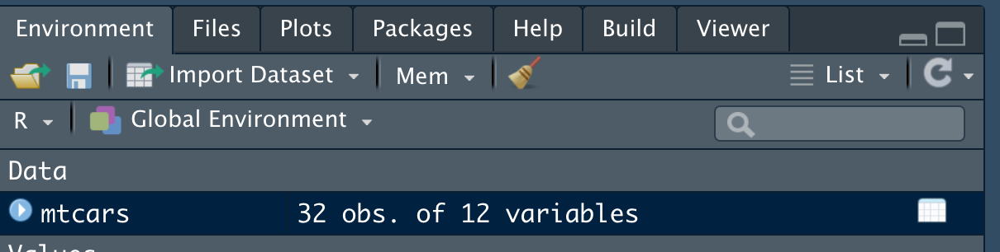

# Daten importieren


## CSV-Dateien importieren

In der Datenanalyse ist das gebräuchlichste Format für Daten in Tabellenform die *CSV-Datei*.
Das hat den Grund, weil dieses Format technisch schön einfach ist.
Für uns Endverbraucher tut das nichts groß zur Sache, die CSV-Datei beherbergt 
einfach eine brave Tabelle, sonst nichts.

Damit Sie eine Datendatei importieren können, müssen Sie wissen, 
wo die Datei ist.

Schauen wir uns zwei Möglichkeiten an,
wo eine Datei liegen könnte.

1. Irgendwo im Internet, z.B. [hier](https://vincentarelbundock.github.io/Rdatasets/csv/datasets/mtcars.csv)
2. Irgendwo auf Ihrem Computer, z.B. in Ihrem Projektordner

In beiden Fällen wird der "Aufenthaltsort" der Datei durch den Pfad (in welcher Ordnerhierarchie?) und den Namen definiert.

In beiden Fallen importieren Sie die Datei wie folgt.
Klicken Sie im Reiter *Environment* auf *Import Dataset* (Ah!), s. Abbildung \@ref(fig:import-data).


```{r import-data, fig.cap = "Datendateien importieren über das Menü in RStudio"}
knitr::include_graphics("img/import-data.png")
```

Wählen Sie `From Text (readr)...`.

Im folgenden Menü geben Sie dann den Pfad zur Datei an, ganz oben bei *File/URL:*, s. Abbildung \@ref(fig:import-data2).

```{r import-data2, fig.cap = "Pfad zur Datendatei eingeben"}

```

Mit einem Klick auf *Update* sehen Sie, was sich hinter dem Pfad verbirgt.
Wenn Sie auf *Import* klicken, 
wird die Datei in R importiert. Voila!

Mit einem Klick auf *Browse* können Sie Ihren Rechner durchforsten nach der gesuchten Datendatei.


Jetzt sehen Sie, dass im Reiter *Environment* ein neuer Eintrag entstanden ist,
und zwar mit dem Namen `mtcars`. 
Das ist der Name, der Datei, die wir eingelesen haben,
und so heißt auch die frisch erzeugte Tabelle (s. Abbildung \@ref(fig:environment)).
Mit Klick auf das Tabellen-Icon können Sie sich die Tabelle anschauen (Nur Anschauen, nicht die Werte verändern).


```{r environment, fig.cap = "Hier sehen Sie die geöffneten Tabellen.", out.width="50%"}

```


Ist sie nicht schön (s. Abbildung \@ref(fig:mtcars-head))? Ein Prachtexampler einer Tabelle, nicht wahr?


```{r mtcars-head, fig.cap = "Die ersten Zeilen der Tabelle 'mtcars'", out.width="50%"}
knitr::include_graphics("img/mtcars-head.png")
```


## CSV-Dateien von innen

Ein Blick in die Motorhaube: 
So sieht eine CSV-Datei aus, wenn Sie sie mit einem Text-Editor öffnen. 


```
"","mpg","cyl","disp","hp","drat","wt","qsec","vs","am","gear","carb"
"Mazda RX4",21,6,160,110,3.9,2.62,16.46,0,1,4,4
"Mazda RX4 Wag",21,6,160,110,3.9,2.875,17.02,0,1,4,4
"Datsun 710",22.8,4,108,93,3.85,2.32,18.61,1,1,4,1
"Hornet 4 Drive",21.4,6,258,110,3.08,3.215,19.44,1,0,3,1
"Hornet Sportabout",18.7,8,360,175,3.15,3.44,17.02,0,0,3,2
```


Wir erkennen: Es ist eine sehr einfach aufgebaute Textdatei.
Wenn Sie lange genug in die Matrix starren, 
erkennen Sie die Spalten.


## SPSS- und Excel-Dateien importieren mit `rio`


Daten in den Formaten von Minitab, SAS, SPSS, Stata, Excel, CSV und andere kann man mit dem
Paket `rio` importieren:


```{r}
library(rio)  # muss installiert sein :-)
```


Dann suchen wir uns einen Datensatz, z.B. ihn hier:

```{r echo = TRUE}
spss_path <- "https://cehd.gmu.edu/assets/dimitrovbook/Anxiety%202.sav"
```

### SPSS


Probieren wir es mit SPSS-Daten aus:

```{r echo = TRUE}
d <- import(spss_path)
head(d)
```

Die Daten stammen aus [dieser Quelle](https://cehd.gmu.edu/book/dimitrov/spss).

### Excel

Oder mit Excel-Daten (.xls und .xlsx):


```{r echo = TRUE}
xlsx_path <- "https://github.com/sebastiansauer/Lehre/raw/main/data/excel-test.xlsx"
```


```{r echo = TRUE}
d2 <- import(xlsx_path)
head(d2)
```


```{r echo = FALSE, eval = FALSE}
download.file(xlsx_path, destfile = "test.xlsx")
d2 <- rio::import("test.xlsx")
head(d2)
```


## Literaturhinweise


Weitere Hinweise findet man z.B. in @sauer_moderne_2019 oder in @ismay_moderndive_2019.


