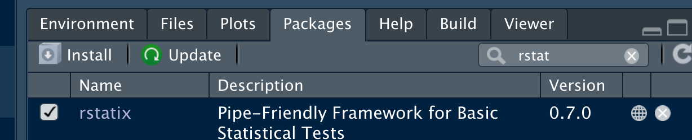

# Deskriptive Statistik


## Metrische Variablen

In R gibt es wie gesagt viele Pakete.
Eines davon, es heißt `rstatix` (nicht unbedingt kreativ, der Name),
birgt eine Reihe komfortabler Befehle der deskriptiven Statistik.


Starten wir also dieses Paket `rstatix`.

Dazu klicken Sie den Namen des Pakets einfach an, s. Abbildung \@ref(fig:start-package).


```{r start-package, fig.cap = "Wenn angehakt, ist das Paket gestartet.", out.width="50%"}

```


*Alternativ* können Sie auch diesen Befehl eingeben:


```{r echo = TRUE}
library("rstatix")
```


Zur Erinnerung: Sie müssen dieses Paket installiert haben, sonst können Sie 
es nicht starten.


So, jetzt geht es rund:

```{r echo = TRUE}
get_summary_stats(mtcars)
```


Der Befehl `get_summary_stats(name_einer_tabelle)` liefert einen Haufen
Statistiken zurück. Braucht das überhaupt ein Mensch, so viel Zeugs?
Na gut, wir sind nicht hier, 
um über den Sinn der Statistik zu diskutieren (muss man als gegeben hinnehmen, nicht wahr?).


Jedenfalls spuckt der Befehl so viele Statistiken aus, dass sie gar nicht auf meinen Bildschirm passen.
Positiv gesagt: Alles da, was das Herz des Datenfreundes höher schlagen lässt.
Ja,ja, ich weiß, Sie können jetzt nur schwer ruhig bleiben vor Aufregung.

Übrigens kann man `get_summary_stats(name_einer_tabelle)` auch noch einstellen,
so dass weniger Statistiken gezeigt werden.

Klicken Sie mal im Reiter *Help* auf das Feld mit der Lupe und geben Sie den Namen der Funktion ein,
also `get_summary_stats`.
Dann kommt eine Hilfeseite, s. Abbildung \@ref(fig:help).

```{r help, fig.cap = "Hier werden Sie geholfen. Die R-Hilfe für jede R-Funktion.", out.width="50%"}
knitr::include_graphics("img/help.png")
```


Nach einigem Lesen sehen wir bei `Arguments`: `type`.
Probieren wir doch mal ein bisschen was aus:


```{r echo = TRUE}
get_summary_stats(mtcars, type = "mean_sd")
```


Ah, das ist schon übersichtlicher! Für jede der 11 Variablen in der Tabelle werden jetzt 
nur noch 3 Statistiken angezeigt:

- n (wie viele Beobachtungen?)
- mean (Mittelwert)
- sd (Standardabweichung)


## Nominale Variablen

Mit dem Befehl `freq_table(name_der_tabelle, name_der_spalte, name_der_spalte)`
können wir uns Häufigkeiten (frequencies) in Tabellenform ausgeben lassen.
Nett!

```{r echo = TRUE}
freq_table(mtcars, am, cyl)
```


## Subgruppenanalyse


Aber was ist, wenn wir eine Subgruppenanalyse machen möchten?
Was ist z.B. der mittlere Spritverbrauch in der Gruppe der Automatikautos (am=0)?

Um eine Subgruppenanalyse zu bekommen,
können wir so vorgehen:

1. Gruppiere den Datensatz entsprechend den Gruppen (Stufen der Variable `am`, also automatisch und manuelles Getriebe)
2. Berechne dann die deskriptiven Statistiken. Die Ergebnisse werden die Gruppierung berücksichtigen.

Grau ist alle Theorie; probieren wir's aus:

```{r echo = TRUE}
mtcars <- group_by(mtcars, am)  # wir gruppieren `mtcars` entlang der Variable `am`
```

Okay, die Tabelle ist jetzt gruppiert.

Jetzt kommt die normale Berechnung der deskriptiven Statistiken,
also genau wie oben:


```{r echo = TRUE}
get_summary_stats(mtcars, mpg, type = "robust")
```

Hier haben wir die deskriptive Analyse auf eine Spalte begrenzt, 
nämlich `mpg` (Spritverbrauch).
Außerdem haben wir "robuste" Statistiken angefordert,
was uns den Median (Lagemaß) und den IQR (Streuungsmaß) beschert hat.


Möchten man den Datensatz wieder "ungruppieren" (die Gruppierung auflösen/löschen),
so geht das auf plausiblem Wege:

```{r echo = TRUE}
mtcars <- ungroup(mtcars)
```

So sieht dann das *un*gruppierte Ergebnis aus,
nicht so spannend:

```{r echo = TRUE}
get_summary_stats(mtcars, mpg, type = "robust")
```


Und dann wieder Häufigkeiten,
weil, warum nicht:

```{r echo = TRUE}
freq_table(mtcars, cyl)
```


## Vertiefung: Datenjudo `dplyr` 


Taucht man etwas tiefer in die Datenanalyse ein,
so tauchen früher oder später (meist früher) Probleme des "Datenjudo" auf:

- Man möchte fehlende Werte ersetzen
- Man möchte Werte umkodieren
- Man muss die Tabelle umformatieren

Für Aufgaben solcher Art ist das R-Paket `dplyr` bestens geeignet.


Einführungen finden sich z.B. im [Kapitel 3](https://moderndive.com/3-wrangling.html) von @ismay_moderndive_2019 oder Kapitel 7 und 9 bei @sauer_moderne_2019.


## Literaturhinweise


In englischer Sprache findet sich ein Überblick an deskriptiver Statistik mit R aus angewandter Perspektive bei @cetinkaya-rundel_introduction_2021, [Kapitel 4-6](https://openintro-ims.netlify.app/explore-numerical.html).
Alternativ bietet @sauer_moderne_2019 einen Überblick (Kapitel 8).

