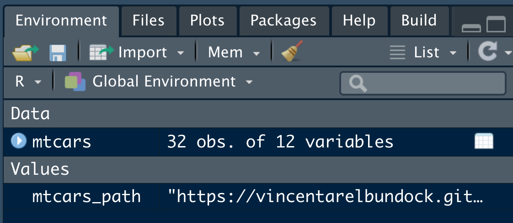

```{r}
knitr::opts_chunk$set(echo = TRUE)
```


# Diagramme


Man kann tolle Diagramme in R erstellen,
aber es braucht etwas Arbeit. 
Zumindest mehr als fünf Minuten.
Daher machen wir es uns hier bequem,
und gehen einen schnelleren Weg,
der auch schöne Diagramme in R erzeugt,
aber dafür nicht so flexibel ist.

Wir benutzen dafür das R-Paket `ggpubr`. 
[Hier](https://rpkgs.datanovia.com/ggpubr/index.html) können Sie sich Demos anschauen.
Sieht nicht schlecht aus, oder?

Zuerst müssen wir es installieren. Das geht auf bekanntem Wege.
Oder sie verwenden den folgenden Befehl,
ist vielleicht komfortabler für Sie,
Sie brauchen dann nur Copy-Pasten:


```{r eval = FALSE}
install.packages("ggpubr")  # nur einmal
```


Dann starten wir das Paket durch Anhaken
oder wiederum mit einem Befehl:

```{r}
library("ggpubr")
```


## Daten importieren


Falls Sie den Datensatz `mtcars` nicht geladen haben (er als *nicht* im Reiter *Environment auftaucht),
dann laden Sie den Datensatz noch schnell.^[Streng genommen, ist dieser Schritt *nicht* nötig, da `mtcars` mit R mitgeliefert wird. Der Übung und der Transparenz halber macht dieser Schritt aber Sinn.]

Sie können einfach die folgende Syntax copy-pasten:


```{r echo = TRUE}
library(rio)  # R-Paket "R Import, Expoert" (rio)

mtcars_path <- "https://vincentarelbundock.github.io/Rdatasets/csv/datasets/mtcars.csv"

mtcars <- import(mtcars_path)
```

Oder Sie lesen im Kapitel [Daten importieren](#daten-importieren) noch einmal nach.


Wenn es funktioniert hat, 
dann sollte `mtcars` unter *Data* im Reiter *Environment* auftauchen,
s. Abb. \@ref(fig:mtcars-loaded).

```{r mtcars-loaded, out.width = "50%", fig.cap = "So sieht's aus, wenn mtcars verfügbar ist auf Ihrem Computer", echo = FALSE}

```


## Zwei Gruppen vergleichen

Ein Klassiker: Zwei Gruppen vergleichen hinsichtlich ihres Mitelwerts oder Medians. 
Fangen wir mal damit an:


```{r}
ggboxplot(mtcars, x = "am", y = "mpg")
```


Merke: Die Argumente der Funktionen bei den Diagramm-Befehlen im R-Paket `ggppubr` sind:

1. Name der Tabelle
2. x: Variable auf der X-Achse
3. y: Variable auf der Y-Achse
4. sonstiges


Als nächstes, sehr ähnliches Diagramm, probieren wir ein Violinenplot.
Aber wir ergänzen noch den Mittelwert pro Gruppe  (und dieses Mal mit der Anzahl der Zylinder auf der X-Achse):

```{r}
ggviolin(mtcars, x = "cyl", y = "mpg", add = "mean")
```


## Streudiagramm

Gibt es wohl einen Zusammenhang von Spritverbrauch `mpg` und PS (`hp`)?

```{r}
ggscatter(mtcars, x = "hp", y = "mpg")
```


Pimp my Diagram:


```{r}
ggscatter(mtcars, 
          x = "hp", y = "mpg", 
          color = "indianred",
          add = "reg.line",  # linearer Trend (Regression)
          title = "Der Zusammenhang von PS und Spritverbrauch",
          mean.point = TRUE)
```


## Convenience ~~Food~~Diagramme

Mit dem R-Paket [ggstatsplot](https://indrajeetpatil.github.io/ggstatsplot/index.html) 
kann man auf komfortable Art publikationsreife Diagramme erzeugen. 

Installieren wir zuerst das Paket:


```{r eval = FALSE}
install.packages("ggstatsplot")
```


Und dann starten wir es:

```{r}
library("ggstatsplot")
```


### Gruppenvergleich


```{r fig.width=7}
ggbetweenstats(mtcars, x = am, y = mpg)
```


Weitere Hinweise zum Gruppenvergleich finden sich [hier](https://indrajeetpatil.github.io/ggstatsplot/articles/web_only/ggbetweenstats.html).


### Streudiagramme


```{r fig.width=7}
ggscatterstats(mtcars, x = hp, y = mpg)
```

Wenn Sie folgende Fehlermeldung bekommen:

`
Error: Package 'ggside' is required for this function to work.
Please install it by running install.packages('ggside').
`

Dann sollten Sie das angefragte Paket, `ggside`, noch installieren auf üblichem Weg.


[Quelle](https://indrajeetpatil.github.io/ggstatsplot/articles/web_only/ggscatterstats.html)

## Fazit


Ist doch schon recht ansehnlich, für fünf Minuten, oder?


## Literaturhinweise

Kapitel 11 bis 14 in @sauer_moderne_2019 geben eine Einführung in Datenvisualisierung mit `ggplot2`. Ein ganzes (und gutes) Buch zu dem, frei verfügbar, bietet Claus Wilke 
[hier](https://clauswilke.com/dataviz/).


